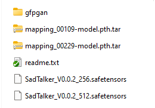

# AiAvatar
Generates talking head (avatar) based on an input face picture and text. Realtime. Uses popular AI models ([SadTalker](https://github.com/OpenTalker/SadTalker),TTS).

## Setup
- Install Anaconda, Python and git.
- Create Anaconda environment _avatar_ and specify Python version 3.8.
```
cd AiAvatar
conda create -n avatar python=3.8
```
- Activate conda environment:
```
conda activate avatar
```
If it doesn't work, go to Anaconda Navigator and activate environment manually. Run terminal from Anaconda Navigator and execute all commands there.

- Install ffmpeg, torch and requirements
```
pip install torch==1.12.1+cu113 torchvision==0.13.1+cu113 torchaudio==0.12.1 --extra-index-url https://download.pytorch.org/whl/cu113

conda install ffmpeg

cd SadTalker
pip install -r requirements.txt
```
- Create folder "checkpoints" in AiAvatar/SadTalker. Download [checkpoints](https://drive.google.com/file/d/1gwWh45pF7aelNP_P78uDJL8Sycep-K7j/view) and [gfpgan](https://drive.google.com/file/d/19AIBsmfcHW6BRJmeqSFlG5fL445Xmsyi?usp=sharing) enhancer to this folder.



- Try running script using example audio and face image from folder AiAvatar/input.
```
python inference.py --driven_audio C:\AI\AiAvatar\input\Thank.wav --source_image C:\AI\AiAvatar\input\face1.png --enhancer gfpgan
```
- Wait for gfpgan download and video generation, folder AiAvatar/results will contain video.

### Setup coqui/TTS for sound generation
- Install TTS
```
pip install TTS
```

Use generated file placed in the ./output directory as input for the SadTalker.

# Troubleshoting
SadTalker installation is described as well here https://youtu.be/yEkLEm-10Mw.

In case of TTS installation error 
```
fatal error LNK1158: cannot run 'rc.exe'
```
use [this solution](https://stackoverflow.com/questions/14372706/visual-studio-cant-build-due-to-rc-exe).

In case of TTS installation error 
```
ResolutionTooDeep(max_rounds)
pip._vendor.resolvelib.resolvers.ResolutionTooDeep: 200000
```
use solution from this comment https://github.com/pypa/pip/issues/12305#issuecomment-1914080691. Reason of this bug is problem in dependency resolution for TTS in 3.8 python. In 3.9 python all works just fine, but we need 3.8 for sad talker.
